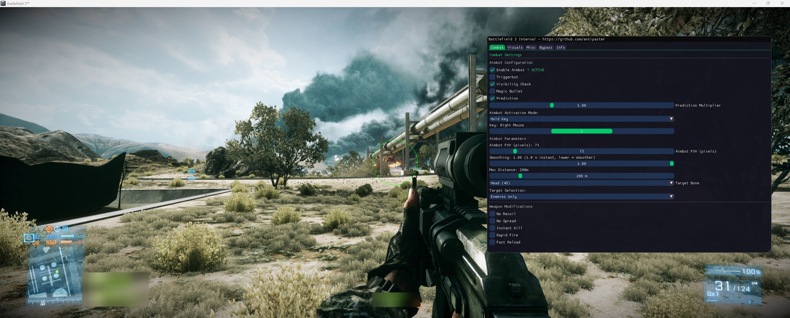

# Battlefield 3 Internal Cheat


## Screenshots




---
## Features

- **Aimbot**: Customizable FOV, smoothing, bone selection, visibility checks, prediction, and more.
- **Triggerbot**: Automatically fires when an enemy is in your crosshair.
- **ESP**:  
  - Player boxes, health bars, names, distance, offscreen pointers, and more.
  - Customizable for teammates/enemies, max distance, and visual style.
- **Weapon Modifications**: No recoil, no spread, instant kill, rapid fire, fast reload.
- **Name Spoofer**: Change your in-game name on the fly.
- **PunkBuster Bypass**: Hide cheats from PunkBuster screenshots.
- **Third Person Toggle**: Switch between first and third person view.
- **ImGui Menu**: Modern, customizable in-game menu for all features.
- **Debug Tools**: Print all entities, view memory usage, and more.


## Getting Started


### Building

1. **Clone the repository:**
   ```bash
   git clone https://github.com/antipaster/bf3-internal.git
   cd bf3-internal
   ```

2. **Open `bf3internal.vcxproj` in Visual Studio.**

3. **Build the project in Release x86 mode.**

4. **Inject the resulting DLL (`bf3internal.dll`) into the Battlefield 3 process.**  
   Use [Xenos](https://github.com/DarthTon/Xenos) or Processhacker for injecting.

5. ⚠️ **Pack the DLL with Themida or VMProtect** 
   Use themida or vmprotect or anything else to pack the dll.
---

## Usage

- Press `INSERT` to open/close the in-game menu.


---

## Credits
- [ocornut/imgui](https://github.com/ocornut/imgui) - ImGui library
- [TsudaKageyu/minhook](https://github.com/TsudaKageyu/minhook) - MinHook library
- Frostbite SDK structures by CypherPresents

